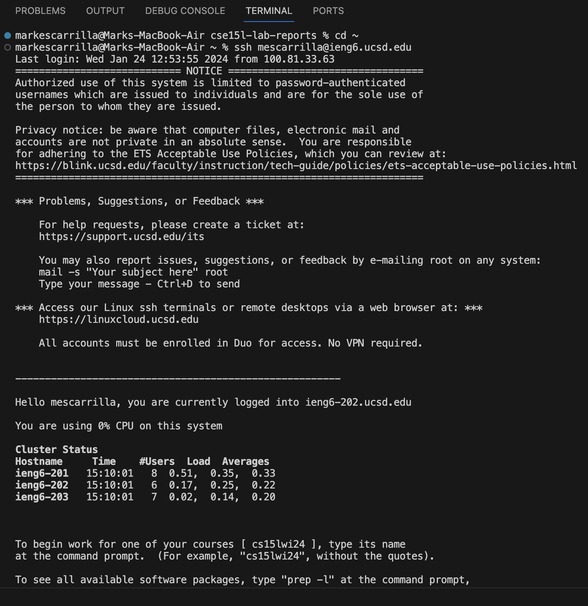

# Lab 2

## Part 1

### ChatServer code
	import java.io.IOException;
	import java.net.URI;
	import java.util.ArrayList;

	class Handler implements URLHandler {
		ArrayList<String> messageLog = new ArrayList<>();

		public String handleRequest(URI url) {
			String query = url.getQuery();
			String chatHistory = "";
			if (url.getPath().equals("/add-message")) {
				if(query.contains("s=") && query.contains("user=")) {
					String query1 = query.split("&")[0];
					String query2 = query.split("&")[1];
					String message = query1.split("=")[1];
					String user = query2.split("=")[1];
					messageLog.add(String.format("%s: %s", user, message));
					for (String s: messageLog) {
						chatHistory += (s + "\n");
					}
					return chatHistory;
				} else {
					return "Invalid input";
				}
			}
			return "Home";
		}
	}

	class ChatServer {
		public static void main(String[] args) throws IOException {
			if(args.length == 0){
				System.out.println("Missing port number! Try any number between 1024 to 49151");
				return;
			}

			int port = Integer.parseInt(args[0]);

			Server.start(port, new Handler());
		}
	}

### Two screenshots of /add-message

* The method that was called is handleRequest.
* The relevant argument of handleRequest is `new URI("http://localhost:4000/add-message?s=hi&user=mark)`. The `ArrayList<String> messageLog` field was updated to include the added message (`mark: hi`).
* The value of `messageLog` is updated because of the path and queries in the URL. The method takes the path and queries and creates a single string equal to the message (`mark: hi`). This string is added to the `messageLog` ArrayList.

* The method that was called is handleRequest.
* The relevant argument of handleRequest is `new URI("http://localhost:4000/add-message?s=how are you&user=mark)`. The `ArrayList<String> messageLog` field was updated to include the added message (`mark: how are you`).
* The value of `messageLog` is updated because of the path and queries in the URL. The method takes the path and queries and creates a single string equal to the message (`mark: how are you`). This string is added to the `messageLog` ArrayList, which already had the `mark: hi` string in it.

## Part 2

### Absolute path to the private key

### Absolute path to the public key

### Logging into `ieng6` account without being asked for a password

## Part 3
In lab 3, I learned how to code a request handling method that processes queries in the URL. I also learned about the `scp` command.