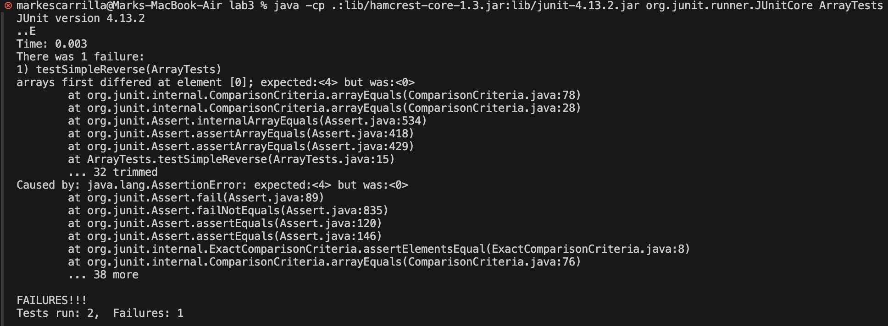

# Lab 3

## Part 1 - Bug Fixing

### Failure-inducing input
	@Test
	public void testSimpleReverse() {
		int[] input1 = {1, 2, 3, 4};
		assertArrayEquals(new int[]{4, 3, 2, 1},
			ArrayExamples.reversed(input1));
	}

### Input that doesn't induce a failure
	@Test
	public void testReversed() {
		int[] input1 = { };
		assertArrayEquals(new int[]{ }, 
			ArrayExamples.reversed(input1));
	}

### Symptom

### Bug before
	static int[] reversed(int[] arr) {
		int[] newArray = new int[arr.length];
		for(int i = 0; i < arr.length; i += 1) {
			arr[i] = newArray[arr.length - i - 1];
		}
		return arr;
	}

### Bug after
	static int[] reversed(int[] arr) {
		int[] newArray = new int[arr.length];
		for(int i = 0; i < arr.length; i += 1) {
			newArray[arr.length - i - 1] = arr[i];
		}
		return newArray;
	}

The method before the fix assigned the elements of the input array to the elements of the newly initialized array and returns the input array. This makes all of the elements in the input array null. The method after assigns the elements of the newly initialized array to the elements of the input array (in reverse order) and returns the newly initialized array.

## Part 2 - `grep` Command

All of the options were found from [https://man7.org/linux/man-pages/man1/grep.1.html](https://man7.org/linux/man-pages/man1/grep.1.html).

### `-m NUM`

#### Command
	grep -m 10 "embryo" technical/biomed/1471-213X-1-1.txt

#### Output
    non-CNS tissues of the embryo. Using a whole mount 
    layers of the embryo.
    embryonic central nervous system [ 27]. To define
    mouse embryos by whole mount 
    E8.5 day embryos (data not shown). At E9.0 
    secondary body axis formation in the mouse embryo [ 28].
    Examination of sections from an E9.5 embryo revealed a high
    In the pharyngeal region of E9.5 embryos, 
    embryos are shown in figure 5.
    of GABA [ 30, 31]. During embryogenesis,

The `-m` option takes in a parameter `NUM` which stops printing after `NUM` matching lines. In this case, `NUM` is 10 and the first 10 lines in `technical/biomed/1471-213X-1-1.txt` that contain `embryo` are printed.

#### Command
	grep -m 4 "gene" technical/biomed/1471-213X-1-1.txt

#### Output
	genes, 
    Gad1 gene lead to defective
    This intriguing genetic evidence indicates a role for
    Gad1 gene is widely expressed in the

The first 4 lines in `technical/biomed/1471-213X-1-1.txt` that contain `gene` are printed.

### `-c`

#### Command
	grep -c "fire" technical/911report/chapter-3.txt

#### Output
	6

The `-c` option prints the number of matching lines. In this case, the output `6` says that 6 lines in `technical/911report/chapter-3.txt` contain `fire`.

#### Command
	grep -c "function" technical/plos/journal.pbio.0020042.txt 

#### Output
	20

The output `20` says that 20 lines in `technical/plos/journal.pbio.0020042.txt` contain `function`.

### `-l`

#### Command
	grep -l "February" technical/biomed/*.txt

#### Output
	technical/biomed/1468-6708-3-10.txt
	technical/biomed/1471-2458-2-11.txt
	technical/biomed/1471-2458-2-3.txt
	technical/biomed/1471-2458-3-9.txt
	technical/biomed/1471-2474-2-1.txt
	technical/biomed/1472-6785-1-3.txt
	technical/biomed/1472-6882-1-10.txt
	technical/biomed/1472-6947-1-5.txt
	technical/biomed/cc367.txt
	technical/biomed/gb-2003-4-4-r26.txt

The `-l` option prints the input files that contain at least one matching line. In this case, the text files in `technical/biomed` that contain `February` are printed.

#### Command
	grep -l "New Jersey" technical/government/About_LSC/*.txt

#### Output
	technical/government/About_LSC/Comments_on_semiannual.txt
	technical/government/About_LSC/ONTARIO_LEGAL_AID_SERIES.txt
	technical/government/About_LSC/Progress_report.txt
	technical/government/About_LSC/State_Planning_Report.txt
	technical/government/About_LSC/State_Planning_Special_Report.txt
	technical/government/About_LSC/Strategic_report.txt

The text files in `technical/goverment/About_LSC` that contain `New Jersey` are printed.

### `-w`

#### Command
	grep -w "gene" technical/biomed/1471-213X-1-1.txt

#### Output
	Gad1 gene lead to defective
    Gad1 gene is widely expressed in the
    The mouse gene encoding the 67 kDa isoform of glutamate

The `-w` option prints only the lines where the matches form whole words. In this case, the lines in `technical/biomed/1471-213X-1-1.txt` that contain the word `gene` are printed.

#### Command
	grep -w "complete" technical/plos/journal.pbio.0020116.txt

#### Output
    and of open, public availability of the complete findings.

The lines in `technical/plos/journal.pbio.0020116.txt` that contain the word `complete` are printed.