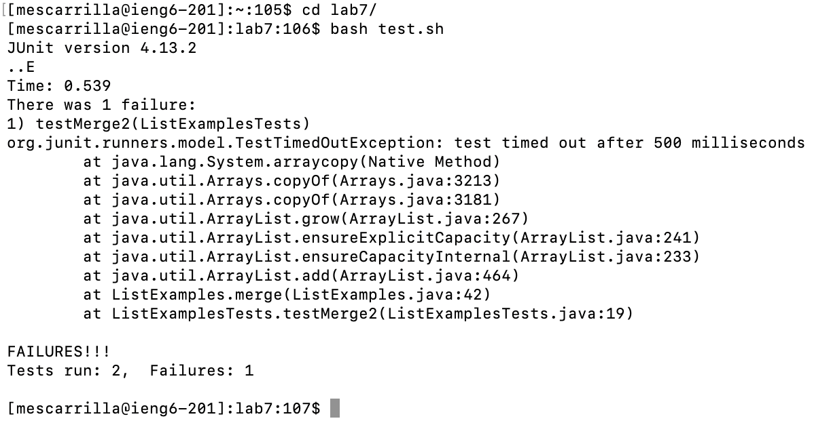

# Lab 4

## Step 4

Keys pressed: ssh`<space>`mescarrilla@ieng6.ucsd.edu`<enter>`

I ran the command to log into ieng6.

## Step 5

Keys pressed: git`<space>`clone`<cmd><v><enter>`

I ran the command to clone the repository. 

## Step 6

Keys pressed: cd`<space>`l`<tab><enter>`, bash`<space>`t`<tab><enter>`

Using tab completion, I made lab7 the working directory. Also using tab completion, I ran the bash script `test.sh` which runs the tests for `ListExamples.java`.

## Step 7

Keys pressed: vim`<space>`L`<tab>`.`<tab><enter>` L `<up><up><up><up><up><up>` e i 2 :x

Using tab completion, I opened `ListExamples.java` in vim. Capital L was used to move to the bottom of the screen. Up arrow was pressed 6 times to get to the correct line. `e` jumps to the end of the word, and `i 2` replaces the 1 in `index1` to 2. `:x` saves and quits the file.

## Step 8

Keys pressed: `<up><up><enter>`

I used the up arrow to access the `bash test.sh` command again.

## Step 9

Keys pressed: git`<space>`add`<space>`L`<tab>`.`<tab><enter>`, git`<space>`commit`<space>`-m`<space>`"fix`<space>`merge`<space>`method"`<enter>`, git`<space>`push`<space>`origin`<space>`main

I ran the commands to commit, stage, and push the changes made to `ListExamples.java` GitHub.