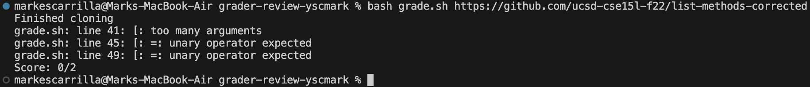
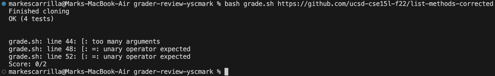
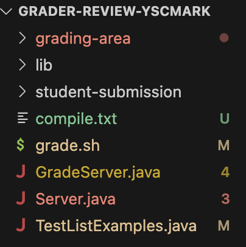

# Lab 5

## Student Post

Hi, I'm getting this error from trying to run my grading script with the corrected repository. There's something wrong with my if conditions, but I'm not sure how to fix it.

## TA Response
If you are comparing the output of a command in the if condition, try echoing the command before the if condition runs.

## Bug Description

The output of the command is "OK (4 tests)", so it is likely that a binary operator is used and there are too many arguments because the output contains 3 "words".

## The Setup
### File and directory structure

### Grading script before fixing the bug
	CPATH='.:lib/hamcrest-core-1.3.jar:lib/junit-4.13.2.jar'

	rm -rf student-submission
	rm -rf grading-area

	mkdir grading-area

	git clone $1 student-submission &> compile.txt
	echo 'Finished cloning'

	# Draw a picture/take notes on the directory structure that's set up after
	# getting to this point

	# Then, add here code to compile and run, and do any post-processing of the
	# tests

	cp student-submission/*.java grading-area
	cp *.java grading-area
	cp -r lib grading-area

	cd grading-area

	if ! [ -f ListExamples.java ]
	then
		echo "Missing ListExamples.java in student submission"
		echo "Score: 0/2"
		exit 1
	fi

	javac -cp $CPATH *.java &> compile.txt
	if [ $? -ne 0 ]
	then 
		echo "Compilation error"
		echo "Score: 0/2"
		exit 1
	fi

	java -cp $CPATH org.junit.runner.JUnitCore TestListExamples &> results.txt

	# Score based on methods passed
	echo $(grep "OK" results.txt)
	echo $(grep "Merge" results.txt)
	echo $(grep "Filter" results.txt)
	if [ $(grep "OK" results.txt) = "OK" ]
	then
		echo "Score: 2/2"
		exit
	elif [ $(grep "Merge" results.txt) = "testMerge" ]
	then
		echo "Score: 1/2"
		exit
	elif [ $(grep "Filter" results.txt) = "testFilter" ]
	then
		echo "Score: 1/2"
		exit
	else
		echo "Score: 0/2"
		exit
	fi

### results.txt before fixing the bug
	JUnit version 4.13.2
	....
	Time: 0.004

	OK (4 tests)

### Command to trigger the bug
	bash grade.sh https://github.com/ucsd-cse15l-f22/list-methods-corrected

### How to fix the bug
Add the -o option to each grep command in order to fit the intended logic. Also, add quotes around each command to prevent the unary operator error.

## Reflection
JDB was new to me, and it was cool using it in order to read local variables at the time of an error. I can definitely see how JDB can allow for efficient debugging.